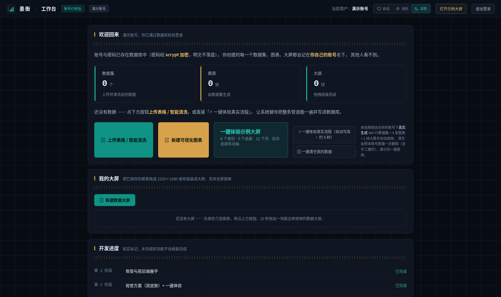
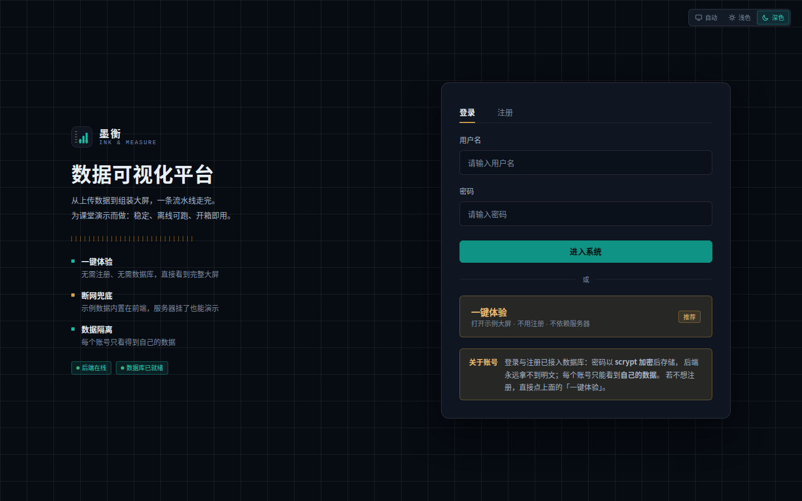
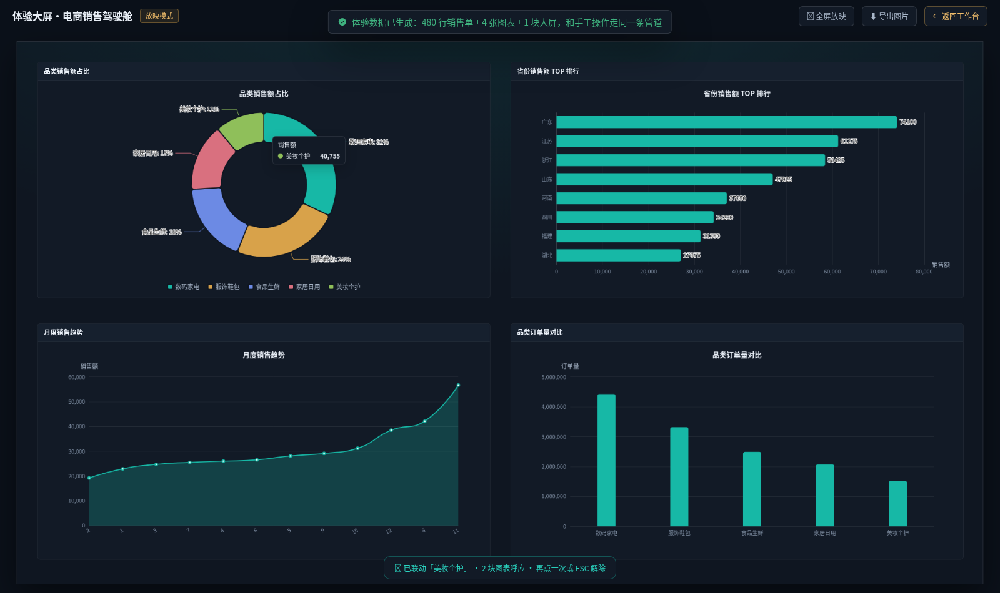
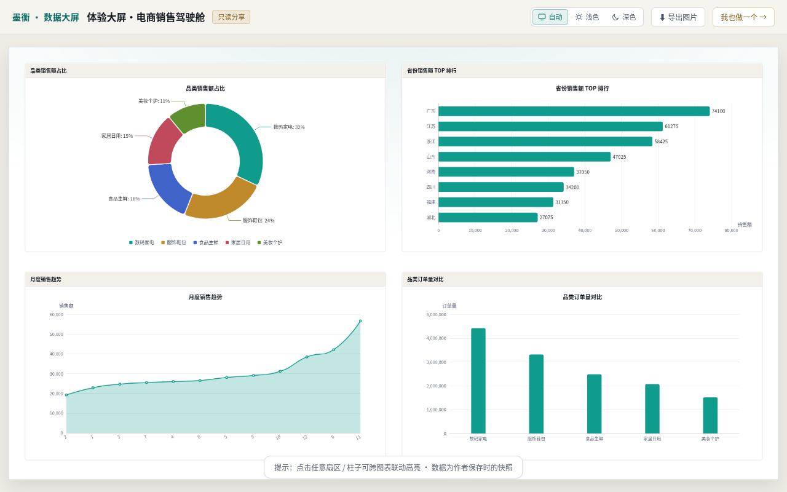

# 墨衡 · 轻量级数据可视化平台

> 一个**课程设计 / 毕业设计级别**的完整全栈项目：上传一份 Excel，**1 分钟内**得到可拖拽组装、能联动、能导出、能免登录分享的可视化大屏。
>
> 本仓库最大的价值不是功能多，而是**每一步都有自动化测试兜底**——
> 全库 **230+ 项测试**（含 41 项越权/隔离测试、116 项双皮肤可读性审计、6 套真浏览器端到端）。
> 如果你想学"一个能答辩、能经得起问的全栈项目长什么样"，这里有一份完整样本。



**许可证**：[CC BY-NC 4.0](LICENSE) —— 学习/课设/毕设可自由参考，**禁止商用**。

---

## 我能从这个项目里学到什么（先说这个）

| 主题 | 去哪看 |
| --- | --- |
| 一个 FastAPI 后端如何**同时兼容 SQLite 和 SQL Server**（方言抽象层 + 防写死方言的静态扫描器） | `backend/app/db/dialect.py`、`backend/tests/_sqlscan.py` |
| **多用户数据隔离**怎么做才算严谨（每条 SQL 必带 UserID + 静态守卫 + 豁免白名单钉死调用点） | `backend/tests/test_isolation.py`（41 项） |
| 不依赖第三方库的**指针拖拽引擎**与**大屏高清导出**（坐标系换算、devicePixelRatio） | `frontend/src/components/DashboardCanvas.vue` |
| 端到端测试的**工程纪律**：基线快照 + 差量清理、等待落定态而不是 sleep、双形态契约覆盖 | `frontend/scripts/_e2e-cleanup.mjs` 及各 `test-*.ui.mjs` |
| 设计令牌（design tokens）驱动的**双主题换肤**，以及"换肤后可读性"如何自动化审计 | `docs/视觉方案.md`、`frontend/scripts/modal-theme-audit.mjs` |
| 项目**分阶段推进**与诚实的进度看板（做没做完、边界在哪，白纸黑字） | 下文"开发路线"一节 |

## 功能一览

- **上传与清洗**：CSV/Excel 编码自动嗅探（GBK 乱码也能救）、合并单元格向下填充、
  合计/空行剔除、数值列自动转型——每一步生成审计徽章，用户看得见系统"替你做了什么"
- **图表构建**：柱状/折线/横向排行/环形饼/散点 5 种，聚合方式 sum·avg·count·max·min，
  后端聚合 + 典型场景防呆向导（选错字段会被拦）
- **大屏组装**：1920×1080 设计坐标系、自由拖拽缩放磁吸、图层、全屏放映、
  **跨图联动高亮**（点饼图一块，全大屏同名维度聚焦）
- **导出**：一键合成 3840×2160 高清 PNG（皮肤跟随、真下载）
- **分享**：随机 token 只读链接，**免登录**观看 + 联动 + 导出；一键失效、重开换钥
- **一键体验 / 一键清空**：一次调用真实跑完整条管道入库并自动放映；演示完两下清空归零

| 登录页 | 放映 + 联动 |
| --- | --- |
|  |  |
| **访客免登录分享页** | |
|  | |

## 技术栈

| 层 | 选型 | 备注 |
| --- | --- | --- |
| 前端 | Vue 3.5（`<script setup>`）+ Vite 6 + ECharts 6.1 + Element Plus | 无路由库（手写 hash 路由，够小够透明） |
| 后端 | Python 3.12 + FastAPI + Uvicorn | 聚合、清洗、鉴权全在后端，前端只管显示 |
| 数据库 | SQLite（零配置默认）/ SQL Server（双栈兼容） | 换库不改业务代码 |
| 驱动 | `pymssql`（自带 FreeTDS） | 不需要装系统 ODBC、不需要管理员权限 |
| 测试 | pytest 风格自研脚本 + Playwright 真浏览器 | 全部可重跑、自动清库 |

## 快速开始（5 分钟，零配置）

前置：Python ≥ 3.10、Node ≥ 18。

```bash
# 1) 后端（默认 SQLite，不需要任何数据库）
cd backend
python3 -m venv .venv
.venv/bin/pip install -r requirements.txt
cp .env.example .env          # 直接可用：SECRET_KEY/演示密码留空会在启动时自动生成
.venv/bin/python -m uvicorn app.main:app --host 127.0.0.1 --port 8000
#   启动日志里会打印演示账号 demo 的随机密码（也写回 .env，随时可查）

# 2) 前端（另开一个终端）
cd frontend
npm install
npm run dev
```

浏览器打开 **http://127.0.0.1:8000/docs** 看接口说明书；打开 **http://127.0.0.1:5173** 用演示账号登录。
进去后先点「⚡ 一键体验真实流程」——系统现场跑完整条管道给你看（约 5 秒后自动放映大屏）。

> 想用 SQL Server（学校教学库/自己装的）：把 `.env` 里 `DB_MODE` 改成 `mssql` 并填连接信息，
> **先跑体检**再切换：`.venv/bin/python tests/check_mssql.py`（七项检查，人话报错）。
> 建议用 `backend/set_db_config.py` 交互式填写——密码不回显、不进命令历史。

### 全部测试怎么跑

见 `README` 下方"测试清单"或直接抄：

```bash
# 后端（HTTP 类需先启动后端）
cd backend
for t in test_data_parser test_data_cleaner test_chart_engine test_schema_portability \
         test_isolation test_auth_http test_datasets_http test_charts_http \
         test_dashboards_http test_share_http test_demo_http; do
  PYTHONPATH=. .venv/bin/python tests/$t.py
done

# 前端六套真浏览器 E2E + 双皮肤审计（需前后端都在运行）
cd frontend && npm install -D playwright && npx playwright install chromium
for t in uploader chart-builder presets dashboard share demo; do
  node scripts/test-${t}-ui.mjs
done
node scripts/modal-theme-audit.mjs      # 116 项：换肤后所有文字是否还看得清
node scripts/rehearse-one-minute.mjs    # 答辩前一分钟全流程彩排（自动清库）
```

> E2E 脚本从 `backend/.env` 读演示密码，不硬编码任何凭据；跑完自动把数据库清回基线。

## 开发路线（一个毕设可以这样拆）

这不是一次性写完的，是 8 个阶段、每阶段"交付 → 测试 → 过目 → 下一阶段"推进的——
这个**节奏本身**就是毕设最缺的东西，直接拿去抄（进度看板代码在 `WorkbenchView.vue`）：

1. **骨架**：前后端握手、健康检查、目录结构
2. **视觉**：设计令牌、双皮肤、登录页、离线示例大屏（断网也能演示）
3. **账号与隔离**：注册/登录（scrypt 哈希 + HMAC 令牌）、真实 SQL Server 接入、41 项隔离测试
4. **数据**：上传解析（编码嗅探/Excel 多 Sheet）→ 清洗 → 全量入库
5. **图表**：后端聚合引擎 + 5 种图型 + 防呆向导
6. **大屏**：手写拖拽引擎、设计坐标系、跨图联动
7. **导出与分享**：2× PNG 合成、免登录 token 链接（可一键作废）
8. **收尾**：一键体验（真实管道写库）、一键清空、全流程彩排

## 项目结构

```
backend/
  app/
    api/          # 路由层：auth / datasets / charts / dashboards(+share) / demo / health
    db/           # 连接、方言抽象、schema、数据访问（函数签名强制 user_id）
    services/     # 解析、清洗、聚合与图表引擎、演示数据（纯业务，可单测）
    security/     # 密码哈希、令牌签发校验
  tests/          # 单元 + HTTP 链路 + 隔离 + 体检脚本（全部可独立重跑）
frontend/
  src/
    components/   # 上传清洗弹窗、图表构建器、大屏画布/放映/设计器、分享页…
    views/        # 登录 / 工作台 / 离线示例大屏 / 公开分享页
    styles/       # 设计令牌（两套皮肤的唯一来源）
  scripts/        # 6 套 Playwright E2E + 双皮肤审计 + 一分钟彩排
docs/             # 数据库设计、视觉方案、答辩演讲稿（示范）
samples/          # 内置演示数据（含故意做脏的 4 种样本）
```

## 几条关键契约（改代码前必读）

| 契约 | 内容 |
| --- | --- |
| 图表配置 | `Charts.ConfigJson` = **裸 ECharts option**；大屏画布兼容 `{option:…}` 历史形态 |
| 大屏布局 | `{"canvas":{w,h},"items":[{id,chart_id,x,y,w,h,z}]}`，items ≤ 30 |
| 快照语义 | 图表/大屏/分享/导出是**保存时**的聚合结果；原始数据变了需重新保存图表才会变（有意为之，见 `docs/答辩演讲稿.md` 里怎么答这个刁钻问题） |
| 隔离签名 | `db/data.py` 每个函数第一参数必须是 `user_id`；分享通道豁免走白名单且**调用点被测试钉死** |
| 数据上限 | 5000 行 / 50 列 / 5MB，超限**明确报错**，绝不静默截断 |

## 已知边界（没做的都写在这）

- 分享链接**即钥匙**：无二级访问口令；无访问日志/有效期
- 导出只有 PNG（无 PDF）；联动是"聚焦高亮"而非数据筛选
- 聚合是保存时快照，无实时刷新；不支持多表关联
- 单实例部署，无并发压测；密码找回未做
- 浏览器兼容按现代内核做，未测 IE

## 文档索引

| 文档 | 内容 |
| --- | --- |
| [docs/数据库设计.md](docs/数据库设计.md) | 表结构、JSON 存储决策、SQLite↔SQL Server 双栈实战与 5 个真实 bug 复盘 |
| [docs/视觉方案.md](docs/视觉方案.md) | 「墨衡」设计语言：令牌体系、两套皮肤、组件规范 |
| [docs/答辩演讲稿.md](docs/答辩演讲稿.md) | 答辩怎么讲：一分钟演示手顺 + 刁钻问题预演答法（给学弟学妹的示范） |
| [samples/README.md](samples/README.md) | 演示样本里各埋了什么坑 |

## 许可证与致谢

CC BY-NC 4.0 —— 见 [LICENSE](LICENSE)。欢迎 fork 学习、当毕设思路参考；**禁止商用**；再分发请保留出处链接。

> 借鉴思路，别照抄答辩。你能跑起来 ≠ 你能讲明白——本项目刻意把"为什么这么做"写进了
> 注释、文档和测试里，请把它们一起读掉。
